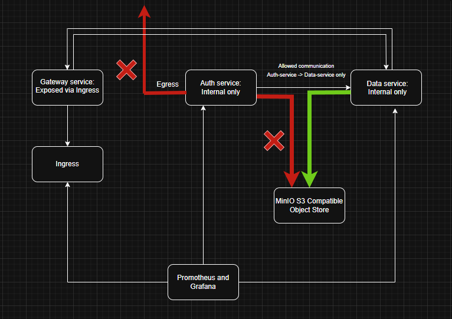
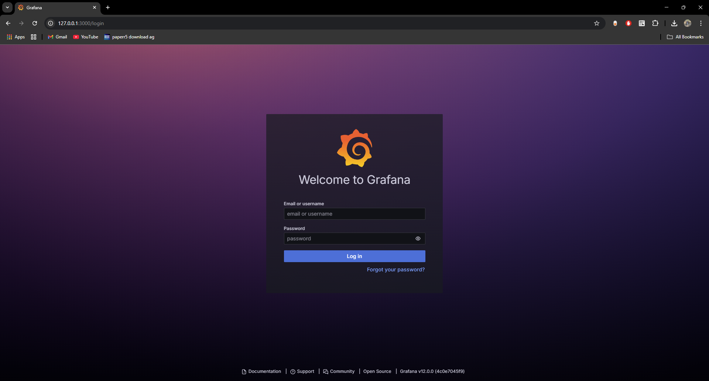

# 🧰 Architecture


# 🧰 Design Decisions:
- Chose Calico as the CNI plugin to support Kubernetes NetworkPolicies. It was used to restrict egress traffic from the auth-service pod, preventing unauthorized external access and enforcing secure communication within the cluster.
- Dedicated application namespace for security isolation and applying namespace-level policies.
- Kyverno was used to prevent pods from logging sensitive Authorization headers and to restrict secret volume mounts ensuring only authorized service accounts can access critical secrets.

# 🧰 Prerequisites

Before you begin, ensure you have the following tools installed and configured:
- **kubectl**
- **Minikube** with the support for `--addons=ingress,metric-server` and `--cni=calico`
- **MinIO and mc (MinIO Client)** 
- **Helm** 
- **Docker**
- **Kyverno**
- **Calico**

# 🧱 Task 1: Microservice Stack Deployment

## 🗂️ Overview

This setup deploys a basic microservices architecture consisting of three services:
| Service       | Purpose                        | Image                      |
|---------------|--------------------------------|----------------------------|
| gateway       | Public API Gateway (Ingress)   | `nginxdemos/hello`         |
| auth-service  | Internal Authentication Logic  | `kennethreitz/httpbin`     |
| data-service  | Internal Business Logic        | `hashicorp/http-echo`      |

All services are containerized and deployed using **Helm**, with:
- Health probes (liveness/readiness),
- Resource requests/limits,
- Scoped network access via Ingress/NAT rules,
- Separated namespaces for system components vs application logic.

## ⚙️ Setup Instructions
### 1. Clone the Repository

```bash
- git clone https://github.com/your-username/microservice-security-sim.git
- cd microservice-security-sim/task-1
```
### 2. Create Namespaces

```bash
- kubectl create ns system
- kubectl create ns application
 ```

### 3. Deploy Services Using Helm
```bash
- helm install gateway ./charts/gateway --namespace application
- helm install auth-service ./charts/auth-service --namespace application
- helm install data-service ./charts/data-service --namespace application
```
### 4. Set Up Ingress
```bash
- kubectl apply -f ingress/gateway-ingress.yaml
```

### 5. Accessing the Services

#### 🔹 Ingress Access (gateway - Public Service)
##### Start Minikube tunnel to expose the ingress:
```bash
sudo minikube tunnel
```
##### Add a host entry for domain mapping:
```bash
127.0.0.1 gateway.local
Add the above line to your /etc/hosts file.
```
##### Access the gateway service:
```bash
Open your browser and visit:
http://gateway.local/
```

#### 🔹 Internal Services (auth-service and data-service)
##### auth-service:
```bash
kubectl port-forward svc/auth-service 8080:80 -n application
```
##### Then test:
```bash
curl http://localhost:8080
```

##### data-service:
```bash
kubectl port-forward svc/data-service 8081:80 -n application
```
##### Then test:
```bash
curl http://localhost:8081
```


# 🧱 Task 2: Simulate IAM with MinIO
This task simulates AWS IAM within a Kubernetes environment using MinIO, demonstrating fine-grained access control across microservices.

---

## 🗂️ Overview

- Deploy MinIO (mock S3) inside the cluster.
- Create Kubernetes Secrets and ServiceAccounts.
- Prove:
  - ✅ `data-service` *can* access the bucket.
  - ❌ `auth-service` *cannot*, even if misconfigured.
- Enforce access control with Kyverno.

---

## ⚙️ Setup Instructions
### 1. Deploy MinIO:
```bash
helm repo add minio https://charts.min.io/
helm repo update
helm install minio minio/minio \
  --namespace application --create-namespace \
  --set accessKey=minioadmin \
  --set secretKey=minioadmin \
  --set mode=standalone \
  --set persistence.enabled=false \
  --set resources.requests.memory=256Mi \
  --set resources.limits.memory=512Mi

```

### 2. Access MinIo UI:
```bash
- kubectl port-forward svc/minio 9000:9000 -n system
```


### 3. RBAC Setup:
```bash
- data-service-sa bound to Role minio-access-role with permissions to read the MinIO secret.
- auth-service's SA has no such binding, and cannot read credentials.
```

### 4. Bucket Policy with mc CLI:
###### 1. Install & Configure:
```bash
- curl -O https://dl.min.io/client/mc/release/windows-amd64/mc.exe
- mv mc.exe ~/bin && chmod +x ~/bin/mc.exe
```

###### 2. Set Aliases:
```bash
- mc.exe alias set myminio http://127.0.0.1:9000 minioadmin minioadmin
- mc.exe admin user add myminio data-service data-service-password
- mc.exe admin user add myminio auth-service auth-service-password
```
###### 3. Allow Policy (for data-service)
```bash
{
  "Version": "2012-10-17",
  "Statement": [
    {
      "Action": [
        "s3:GetBucketLocation",
        "s3:ListBucket"
      ],
      "Effect": "Allow",
      "Resource": [
        "arn:aws:s3:::minio-first-bucket"
      ]
    },
    {
      "Action": [
        "s3:GetObject",
        "s3:PutObject",
        "s3:DeleteObject"
      ],
      "Effect": "Allow",
      "Resource": [
        "arn:aws:s3:::minio-first-bucket/*"
      ]
    }
  ]
}
```
###### 4. Deny Policy (for auth-service):
```bash
{
  "Version": "2012-10-17",
  "Statement": [
    {
      "Effect": "Deny",
      "Action": ["s3:*"],
      "Resource": [
        "arn:aws:s3:::minio-first-bucket",
        "arn:aws:s3:::minio-first-bucket/*"
      ]
    }
  ]
}
```


###### 5. Set Policies:
```bash
- mc.exe admin policy create myminio data-service-policy ./k8s/data-service-policy.json
- mc.exe admin policy attach myminio --user data-service data-service-policy

- mc.exe admin policy create myminio auth-service-policy ./k8s/auth-service-policy.json
- mc.exe admin policy attach myminio --user auth-service auth-service-policy
```

###### 6. Create secrets using kubectl:
```bash
# For auth-service
- kubectl create secret generic auth-minio-credentials \
  --from-literal=MINIO_ACCESS_KEY=auth-service \
  --from-literal=MINIO_SECRET_KEY=auth-service-password

# For data-service
- kubectl create secret generic data-minio-credentials \
  --from-literal=MINIO_ACCESS_KEY=data-service \
  --from-literal=MINIO_SECRET_KEY=data-service-password
```

###### 7. Validate:
```bash
- kubectl exec -n application data-service-658fd84c85-d9cz5 -c sidecar-container -- mc alias set myminio http://minio.application.svc.cluster.local:9000 data-service data-service-password
- kubectl exec -n application data-service-658fd84c85-d9cz5 -c sidecar-container -- mc ls myminio/minio-first-bucket

- kubectl exec -n application auth-service-5c69c647f7-xt9sx -c sidecar-container -- mc alias set myminio http://minio.application.svc.cluster.local:9000 auth-service auth-service-password
- kubectl exec -n application auth-service-5c69c647f7-xt9sx -c sidecar-container -- mc ls myminio/minio-first-bucket
```

### 8. Kyverno Policy Enforcement
###### 1. Install Kyverno and apply policy:
```bash
helm repo add kyverno https://kyverno.github.io/kyverno/
helm repo update
helm install kyverno kyverno/kyverno --namespace kyverno --create-namespace
```

###### 2. Enforcing IAM-like Policy with Kyverno
```bash
kubectl apply -f ./k8s/minio-secret-access-policy.yaml
```
###### 3. Result:
- data-service pods (using data-service-sa) can mount and use MinIO credentials.
- auth-service pods (using a different service account) cannot mount the secret, thus cannot access MinIO credentials at all, adding a strong access control layer.

# 🧱 Task 3: Security Incident Simulation

## 🗂️ Overview
The auth-service is leaking Authorization headers to logs and is able to reach services it shouldn't — including external endpoints.

- Investigate logging of sensitive data.
- Fix the application/deployment to stop leaking headers.
- Restrict network communication with NetworkPolicies.
- Implement safeguards (OPA, Kyverno, or Falco) to prevent future violations.

### 1. Remember to start Minikube with Calico

```bash
- minikube start --cpus=2 --memory=4096 --addons=ingress,metrics-server --cni=calico
```

### 2. Verify Calico installation:

```bash
- kubectl get pods -n kube-system | grep calico
```
### 3. Investigate the Leak:

```bash
- kubectl logs <auth-service-pod-name> -n application
- Look for log lines containing: Authorization: Bearer <TOKEN>
```

### 4. Apply NetworkPolicy:
```bash
- kubectl apply -f ./k8s/auth-service-egress-policy.yaml
```
### 5. Test Connectivity:
From within the pod:
```bash
- kubectl exec -it -n application auth-service-xxx -c sidecar-container1 -- sh curl http://data-service:80   # Should work
- kubectl exec -it -n application auth-service-xxx -c sidecar-container1 -- sh curl http://google.com        # Should fail if egress is blocked
```

### 6. Set Up Kyverno Policy to Prevent Future Leaks
```bash
- kubectl apply -f block-auth-logging.yaml
```

- To test it, spin up a violating pod
```bash
apiVersion: v1
kind: Pod
metadata:
  name: test-bad-auth-pod
spec:
  containers:
  - name: logger
    image: busybox
    command: ["sh", "-c", "echo Authorization: Bearer token"]
```
- You would see:
```bash
Error from server: error when creating "pod.yaml": admission webhook "validate.kyverno.svc-fail" denied the request: 

resource Pod/default/test-auth-pod was blocked due to the following policies

block-auth-header-logging:
  block-auth-command: 'validation error: Containers must not log Authorization headers
    in command or args. rule block-auth-command failed at path /spec/containers/0/command/'
```

# 🧱 Task 4: Microservice Stack Deployment

## 🗂️ Overview
Set up monitoring for your Kubernetes cluster using Prometheus and Grafana. Visualize key metrics such as:

- Pod CPU & Memory usage
- HTTP Request Rates and Errors
- Pod Restarts
- Configure alerts for abnormal restarts or failed probes using Prometheus or Grafana.

## ⚙️ Setup Instructions
### 1. Add Prometheus Helm Chart and Install the Stack

```bash
- kubectl create namespace monitoring
- helm repo add prometheus-community https://prometheus-community.github.io/helm-charts
- helm repo update
- helm install monitoring prometheus-community/kube-prometheus-stack -n monitoring
```

### 2. Verify Installation

```bash
- kubectl get pods -n monitoring
```

### 3. Access Grafana

```bash
- kubectl port-forward -n monitoring svc/monitoring-grafana 3000:80
- Then open your browser and visit: http://localhost:3000
```



### 4. Dashboards to Create in Grafana

#### 🔹  Pod CPU/Memory Usage
```bash
Use kube_pod_container_resource_requests_cpu_cores and kube_pod_container_resource_requests_memory_bytes
```
#### 🔹  HTTP Request Rates & Errors
```bash
Use metrics like http_requests_total, http_requests_duration_seconds_bucket, and http_errors_total (depending on your instrumentation)
```
#### 🔹 Pod Restarts
```bash
Use kube_pod_container_status_restarts_total
```


### 5. Alert rules


### 6. Monitoring Metrics (PromQL Queries)
Below are the PromQL queries used to visualize and monitor the auth-service, data-service, and gateway microservices:

#### 🔹 CPU Usage (per Pod)
```bash
- sum(rate(container_cpu_usage_seconds_total{namespace="application", pod=~"gateway.*"}[5m])) by (pod)
- sum(rate(container_cpu_usage_seconds_total{namespace="application", pod=~"data-service.*"}[5m])) by (pod)
- sum(rate(container_cpu_usage_seconds_total{namespace="application", pod=~"auth-service.*"}[5m])) by (pod)
```
#### 🔹 Memory Usage (per Pod)
```bash
- sum(container_memory_usage_bytes{namespace="application", pod=~"gateway.*"}) by (pod)
- sum(container_memory_usage_bytes{namespace="application", pod=~"data-service.*"}) by (pod)
- sum(container_memory_usage_bytes{namespace="application", pod=~"auth-service.*"}) by (pod)
```

#### 🔹 Pod Restarts
```bash
- sum by (pod) (kube_pod_container_status_restarts_total{namespace="application", pod=~"gateway.*"})
- sum by (pod) (kube_pod_container_status_restarts_total{namespace="application", pod=~"data-service.*"})
- sum by (pod) (kube_pod_container_status_restarts_total{namespace="application", pod=~"auth-service.*"})
```
# 🧱 Task 5: Microservice Stack Deployment

## 🗂️ Overview
Simulate a pod failure and verify that:

- The system self-heals via ReplicaSet
- The event is observable (e.g., via Grafana metrics or kubectl logs)

## ⚙️ Setup Instructions
### 1. Check Deployment Replica Status

```bash
- kubectl get deployment auth-service -n application
```
### 2. If replicas = 1, scale up temporarily:

```bash
- kubectl scale deployment auth-service --replicas=2 -n application
```
### 3. Kill a Pod

```bash
- kubectl get pods -n application
- kubectl delete pod <POD_NAME> -n application
```
### 4. After deleting the pod, Kubernetes should spin up a new one.

```bash
- kubectl get pods -n application -w
```
### 5. Observe in Grafana dashboard or use the below kubectl command

```bash
- kubectl get events -n application --sort-by=.lastTimestamp
```

# 🧰 Common Errors
You may encounter some common errors while using this project. For detailed explanations and solutions, please refer to the [error](./error.md)
 file.